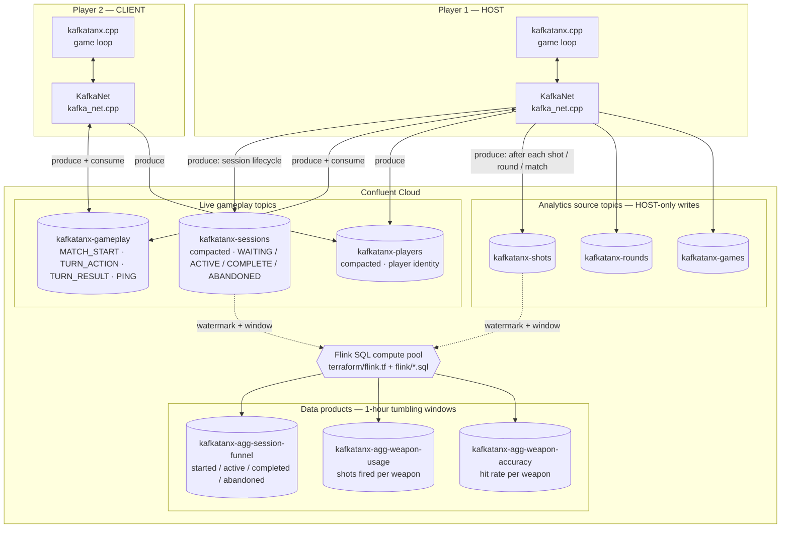

# KafkaTanx

A two-player turn-based tank artillery game — a fork of [TANX](../tanx) where the
local LAN TCP networking has been replaced with **Apache Kafka topics on
[Confluent Cloud](https://confluent.cloud)**.

Players anywhere in the world can compete without port-forwarding or IP sharing.
Every shot, round, and match is streamed as an Avro event so the game server
admin can build real-time leaderboards, weapon-meta dashboards, and win-rate
analytics using **Confluent Flink SQL**.

> **This repo is the player client.** The Confluent Cloud cluster is managed
> separately by the admin (see the Admin section below).

---

## How it works

Instead of connecting directly to each other over TCP, both players connect to a
shared Confluent Cloud cluster. Game traffic flows through the
`kafkatanx-gameplay` topic (keyed by game code); the HOST alone writes session
lifecycle and analytics events, which a Flink SQL pipeline rolls up into
derived "data product" topics.



Notes on the diagram:
- `kafkatanx-sessions` is write-only from the app's side — nothing in-game
  consumes it, it exists purely as a Flink source for the session-funnel data
  product.
- `PING` is a transport-only heartbeat (see [kafkatanx.cpp](kafkatanx.cpp)) used
  to detect a peer going silent mid-match; it isn't part of the registered
  Avro schema and carries no payload.
- The three `kafkatanx-agg-*` topics, the Flink compute pool, and the SQL
  statements that populate them are all provisioned by `terraform apply`
  (`terraform/flink.tf`) — see [flink/](flink/) for the SQL itself.

---

## Prerequisites

### Install librdkafka

KafkaTanx requires **librdkafka**, the official Apache Kafka C++ client library.

| Platform | Command |
|---|---|
| macOS | `brew install librdkafka` |
| Linux (Debian/Ubuntu) | `sudo apt install librdkafka-dev` |
| Windows (MSYS2 UCRT64 shell) | `pacman -S mingw-w64-ucrt-x86_64-librdkafka` |

Also install the same build dependencies as the base game:

**macOS:**
```sh
xcode-select --install
brew install libpng librdkafka
```

**Linux:**
```sh
sudo apt install build-essential libx11-dev libgl1-mesa-dev libpng-dev librdkafka-dev
```

**Windows (MSYS2 UCRT64 shell):**
```sh
pacman -S mingw-w64-ucrt-x86_64-gcc make mingw-w64-ucrt-x86_64-librdkafka
```

---

## Getting credentials

`client-kafka.ini` in this repo contains the Confluent Cloud connection details.
Contact the game admin to receive a filled-in copy, or if you have admin access,
fill in the `REPLACE_WITH_*` placeholders yourself (see the Admin section).

---

## Building

```sh
git clone <this-repo>
cd kafkatanx
make
```

On first launch the game will prompt you for a display name and write it to
`client-kafka.ini`. The UUID player ID is generated automatically.

---

## Playing over the internet

1. **HOST:** launch the game → click **NETWORK** → **HOST GAME**.
   A 6-character game code (e.g. `TIGER7`) is displayed on screen.
2. **HOST:** share the code with your opponent via any channel (Discord, text, etc.)
3. **CLIENT:** launch the game → click **NETWORK** → **JOIN GAME** → type the code → press Enter.
4. The match starts automatically once both players are connected.

No IP addresses. No port forwarding. Works from any network.

---

## Controls

| Action | Input |
|---|---|
| Adjust angle | `A` / `D`, click `−` / `+` buttons, or type a value |
| Adjust power | `W` / `S`, click `−` / `+` buttons, or type a value |
| Move tank | `←` / `→` or click `[<]` / `[>]` in the HUD |
| Select weapon | Click a weapon box in the bottom HUD row |
| Fire | `SPACE` or click the plunger button |
| Skip turn | `ENTER` |
| Surrender | Click the white flag button |

---

## Project structure

```
kafkatanx.cpp         Game source (tanx.cpp with TCP replaced by Kafka)
kafka_net.h / .cpp    Kafka producer/consumer wrapper (librdkafka)
avro_codec.h / .cpp   Avro binary encode/decode + Confluent wire format
schemas/              Avro schema definitions (.avsc) — registered by admin
client-kafka.ini      Confluent Cloud credentials + player identity
olcPixelGameEngine.h  Graphics engine (bundled, third-party)
miniaudio.h           Audio engine (bundled, third-party)
Makefile              Cross-platform build (macOS / Linux / Windows MSYS2)
```

---

## Admin guide

### Confluent Cloud setup

1. Create a cluster in **AWS eu-west-1** (or nearest region to your players).
2. Create a **service account** for game clients with restricted ACLs (see below).
3. Create a **Schema Registry** and register the six schemas.
4. Pre-create all topics with the settings below.
5. Fill in `client-kafka.ini` and commit it.

### Topics to create

| Topic | Cleanup policy | Partitions | Notes |
|---|---|---|---|
| `kafkatanx-sessions` | compact | 6 | Session registry; key=game_code |
| `kafkatanx-gameplay` | delete (24h) | 12 | Game traffic; key=game_code |
| `kafkatanx-players` | compact | 6 | Player identity; key=player_id |
| `kafkatanx-shots` | delete (90d) | 12 | Analytics; key=game_code-round-turn |
| `kafkatanx-rounds` | delete (90d) | 6 | Analytics; key=game_code-round |
| `kafkatanx-games` | delete (90d) | 6 | Analytics; key=game_code |

### Service account ACLs (player client)

| Topic | WRITE | READ |
|---|---|---|
| `kafkatanx-sessions` | ✓ | ✓ |
| `kafkatanx-gameplay` | ✓ | ✓ |
| `kafkatanx-players` | ✓ | ✗ |
| `kafkatanx-shots` | ✓ | ✗ |
| `kafkatanx-rounds` | ✓ | ✗ |
| `kafkatanx-games` | ✓ | ✗ |

Players cannot read analytics, cannot create topics, and cannot access any
other cluster resources.

### Registering Avro schemas

```sh
# Install the Confluent CLI first: https://docs.confluent.io/confluent-cli/current/install.html
confluent login

# Register each schema (repeat for all six)
confluent schema-registry schema create \
  --subject kafkatanx-sessions-value \
  --schema schemas/SessionEvent.avsc \
  --type AVRO

confluent schema-registry schema create \
  --subject kafkatanx-gameplay-value \
  --schema schemas/GameplayMessage.avsc \
  --type AVRO

confluent schema-registry schema create \
  --subject kafkatanx-players-value \
  --schema schemas/PlayerProfile.avsc \
  --type AVRO

confluent schema-registry schema create \
  --subject kafkatanx-shots-value \
  --schema schemas/ShotEvent.avsc \
  --type AVRO

confluent schema-registry schema create \
  --subject kafkatanx-rounds-value \
  --schema schemas/RoundEvent.avsc \
  --type AVRO

confluent schema-registry schema create \
  --subject kafkatanx-games-value \
  --schema schemas/GameEvent.avsc \
  --type AVRO
```

After registration, note the schema IDs returned and fill them into
`client-kafka.ini` under `[schema-ids]`.

### Analytics with Flink SQL

Example — live player leaderboard aggregating from `kafkatanx-games`:

```sql
SELECT
  COALESCE(winner_name, 'Draw') AS player,
  COUNT(*)                       AS wins
FROM kafkatanx_games
WHERE winner_name IS NOT NULL
GROUP BY winner_name;
```

Example — weapon hit-rate from `kafkatanx-shots`:

```sql
SELECT
  weapon,
  COUNT(*)                                      AS total_shots,
  SUM(CASE WHEN hit THEN 1 ELSE 0 END)         AS hits,
  AVG(CAST(hit AS DOUBLE))                      AS hit_rate,
  AVG(CAST(damage_dealt AS DOUBLE))             AS avg_damage
FROM kafkatanx_shots
GROUP BY weapon;
```

---

## Credits

- Built on [olc::PixelGameEngine](https://github.com/OneLoneCoder/olcPixelGameEngine) by Javidx9
- Audio powered by [miniaudio](https://miniaud.io) by David Reid
- Kafka client: [librdkafka](https://github.com/confluentinc/librdkafka) by Confluent
- Inspired by *Tanx* (1991) by Gary Roberts
- Original base game: [TANX](../tanx)

See [THIRD_PARTY_LICENSES.md](THIRD_PARTY_LICENSES.md) for full licence details.

---

## Licence

This project's own code is released under the OLC-3 licence — see [LICENSE](LICENSE).
